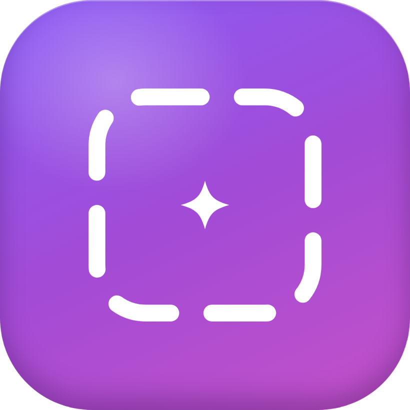
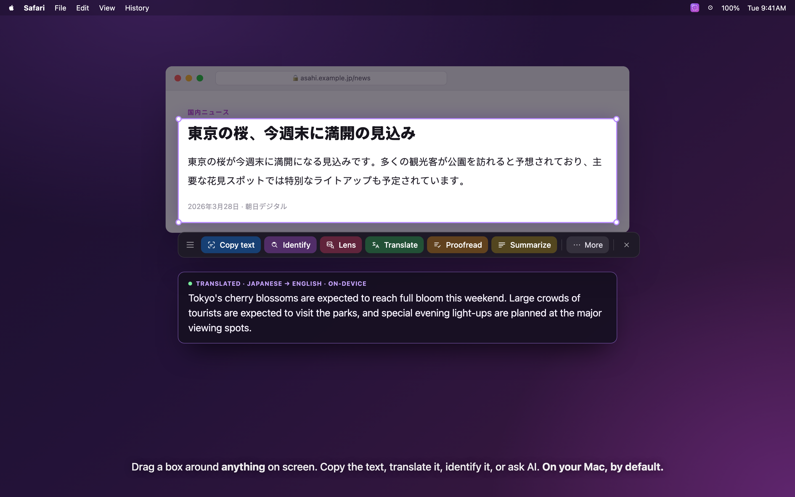
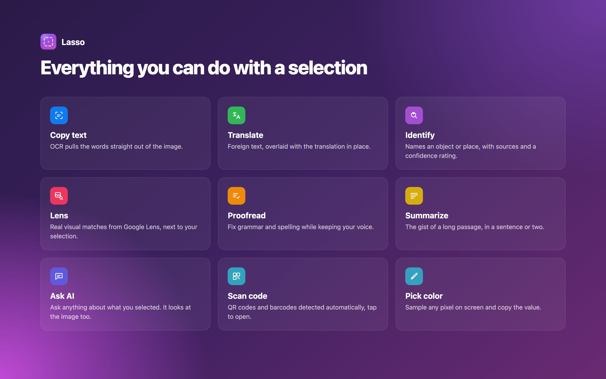
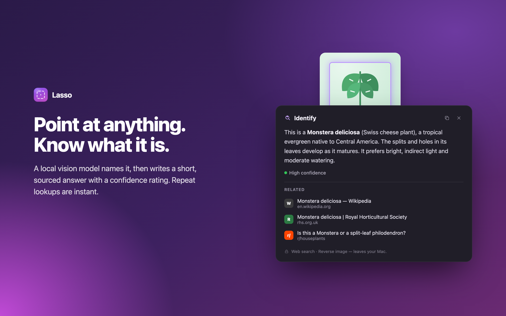
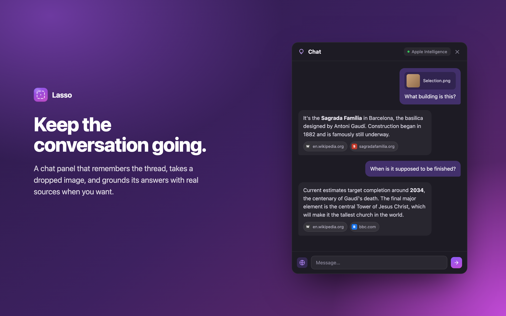
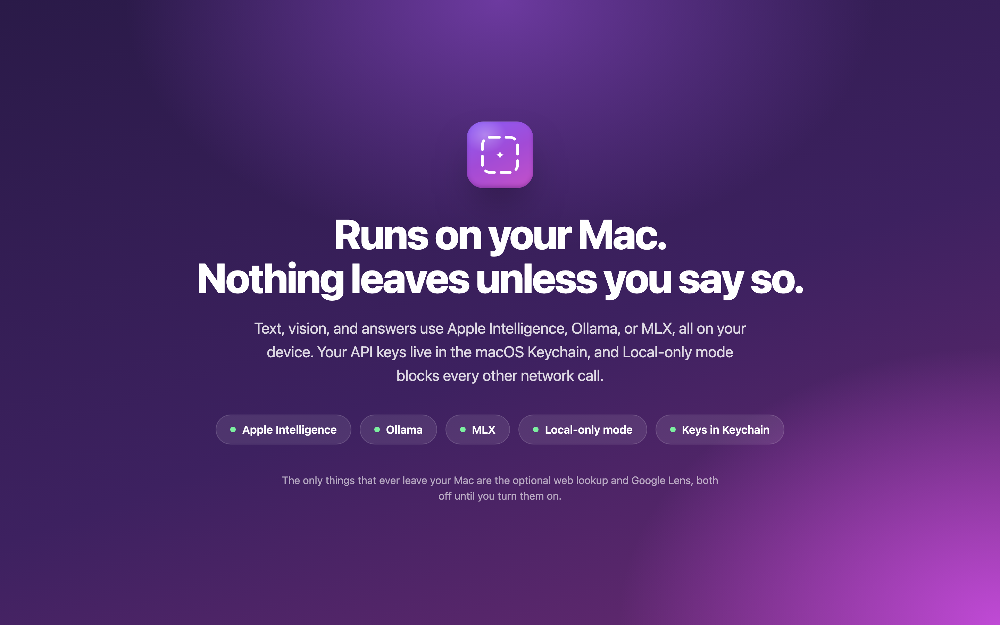

# Lasso

Lasso is a little menu-bar app for Apple Silicon Macs. Hit a hotkey, the screen
freezes, you drag a box around anything on it, and a small toolbar pops up with
things you can do — copy the text, translate it, ask an AI about it, figure out
what an object is, scan a QR code, grab a color.

Think "Circle to Search," but native to the Mac and **local by default** —
nothing leaves your machine unless you decide it should.

## What you can do with a selection

- **Copy text** — OCR pulls the words straight out of the image.
- **Translate in place** — foreign text is overlaid with the translation right
  where it sits, and it handles mixed-language selections gracefully.
- **Summarize / Ask AI** — summarize the selection or ask anything about it; if
  it's a textless image, the AI actually looks at the picture.
- **Identify** — point it at an object, product, place, or screenshot and it
  tells you what it is, with sources and a confidence rating.
- **Scan QR / barcodes**, and **pick a color** from any pixel.

## Identify

A local vision model names it, then writes a short, sourced answer with a
confidence rating. Repeat lookups are instant.

## Chat

A persistent chat panel that remembers the thread, takes a dropped image, and
grounds its answers with real sources when you want.

## Privacy

Out of the box everything runs on your Mac — text via **Apple Intelligence**,
vision and ranking via a local **Ollama** model. The only thing that leaves your
Mac is the optional web lookup in Identify, and it's off until you turn it on.
There's a **Local-only mode** that forces a local model and blocks every
incidental network call. Cloud models (OpenAI, Groq, Anthropic, custom) are
supported too, but strictly opt-in; API keys live in the macOS Keychain.

## Install

1. Download **`Lasso.dmg`** from the [Releases](../../releases) page.
2. Open it and drag **Lasso** to Applications.
3. First launch: **right-click the app → Open**. macOS warns it can't verify the
   developer — that's expected, the build isn't notarized. After opening once, it
   just works.
4. Grant **Screen Recording** in System Settings → Privacy & Security, then
   relaunch. The capture shortcut defaults to **⌥⌘Space** (changeable in Settings).

## Requirements

Apple Silicon Mac on **macOS 26+**. For the local AI paths, install
[Ollama](https://ollama.com) and pull a model or two
(`ollama pull qwen3:4b`, `ollama pull qwen3-vl:2b`). Apple Intelligence works
with no setup.

---

*The source code is private; this repo hosts the downloads.*
